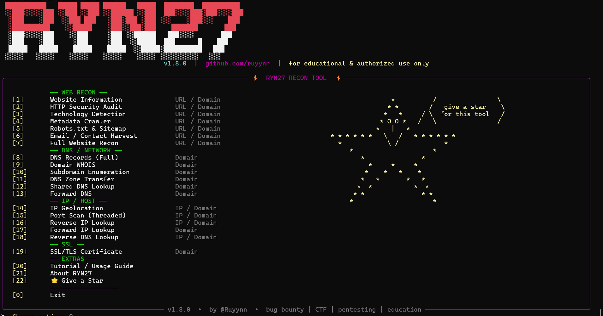

# RYN27 — Ultimate Information Gathering Tool
 
[](https://python.org)
[](https://github.com/ruyynn/RYN27/releases)
[](LICENSE)
[](https://github.com/ruyynn/RYN27/stargazers)
[](https://github.com/ruyynn/RYN27/issues)
[]()
 
> **RYN27** adalah alat *information gathering* berbasis CLI yang menggabungkan WHOIS, DNS, port scanning, IP geolocation, reverse lookup, dan technology detection dalam satu antarmuka terminal yang bersih dan premium. Dibuat untuk security researcher, bug bounty hunter, CTF player, dan sysadmin yang butuh tool recon yang cepat, ringan, dan tidak ribet.
 
---
 
## 📸 Screenshot
 

 
---

## ✨ Fitur

| # | Fitur | Deskripsi |
|---|-------|-----------|
| 1 | **Website Information** | HTTP headers lengkap, status code, response time, cookies, server, page title |
| 2 | **Domain Whois Lookup** | Registrar, creation/expiry date, name servers, email, organisasi, negara |
| 3 | **Find IP Location** | Geolocation IP — negara, kota, ZIP, koordinat GPS, ISP, org, AS number |
| 4 | **Port Scan** | TCP connect scan ke 21 port umum dengan deteksi nama service |
| 5 | **DNS Whois Lookup** | WHOIS lookup via DNS records |
| 7 | **DNS Zone Transfer** | AXFR attempt ke seluruh nameserver untuk enumerasi DNS |
| 8 | **Reverse IP Lookup** | Temukan domain lain yang hosted di IP yang sama |
| 9 | **Forward IP Lookup** | Resolve domain ke IP address (A record) |
| 10 | **Reverse DNS Lookup** | PTR record lookup dari IP ke hostname |
| 11 | **Forward DNS Lookup** | A record lookup dari domain |
| 12 | **Shared DNS Lookup** | Temukan domain yang berbagi nameserver yang sama |
| 13 | **Technology Lookup** | Deteksi CMS, framework, CDN, analytics, dan stack teknologi lainnya |
| 14 | **Website Recon** | Gabungan website information + technology lookup dalam satu scan |
| 15 | **Metadata Crawler** | Ekstrak semua meta tags (name, property, http-equiv) dari halaman |

---

## 📦 Instalasi

### Linux & macOS
```bash
git clone https://github.com/ruyynn/RYN27.git
cd RYN27
python3 RYN27.py
```

### Windows
```bash
git clone https://github.com/ruyynn/RYN27.git
cd RYN27
python RYN27.py
```

### Termux (Android)
```bash
pkg update && pkg upgrade
pkg install python git
git clone https://github.com/ruyynn/RYN27.git
cd RYN27
python RYN27.py
```

### Manual (tanpa git)
```bash
pip install requests rich python-whois dnspython builtwith beautifulsoup4
python RYN27.py
```

> **Note:** Semua dependencies terinstall **otomatis** saat pertama kali dijalankan. Tidak perlu install manual kecuali ada masalah.

---

## ⚠️ Disclaimer

```
RYN27 dibuat HANYA untuk keperluan edukasi dan pengujian keamanan yang LEGAL.

✅ BOLEH digunakan pada:
   - Server / website milik sendiri
   - Target dengan izin tertulis eksplisit dari pemilik
   - Lab environment, CTF, dan platform bug bounty resmi

❌ DILARANG digunakan pada:
   - Website / server orang lain tanpa izin
   - Infrastruktur pemerintah dan militer
   - Layanan publik dan komersial tanpa persetujuan

Penggunaan tool ini sepenuhnya menjadi tanggung jawab pengguna.
Developer tidak bertanggung jawab atas segala bentuk penyalahgunaan.
Pelanggaran dapat dikenakan sanksi hukum sesuai UU ITE dan regulasi setempat.
```

---

## 🤝 Kontribusi

RYN27 adalah proyek open source dan berkembang berkat kontribusi komunitas. Semua bentuk kontribusi diterima dengan tangan terbuka.

**Cara berkontribusi:**

1. Fork repository ini
2. Buat branch baru: `git checkout -b fitur-baru`
3. Commit perubahan: `git commit -m "Tambah fitur baru"`
4. Push ke branch: `git push origin fitur-baru`
5. Buat Pull Request

**Atau cukup:**

- 🐛 [Laporkan bug](https://github.com/ruyynn/RYN27/issues/new?template=bug_report.md)
- 💡 [Usulkan fitur](https://github.com/ruyynn/RYN27/issues/new?template=feature_request.md)
- ⭐ Beri bintang kalau tool ini bermanfaat — itu sudah sangat berarti

[](https://github.com/ruyynn/RYN27/graphs/contributors)
[](https://github.com/ruyynn/RYN27/network/members)
[](https://github.com/ruyynn/RYN27/pulls)

---

## 📬 Kontak

Ada pertanyaan, ide, kolaborasi, atau sekadar mau ngobrol soal security? Reach out:

[](https://web.facebook.com/profile.php?id=61587795784907)
[](mailto:ruyynn25@gmail.com)
[](https://github.com/ruyynn)

---

## ☕ Donasi

Kalau RYN27 pernah ngebantu pekerjaan atau belajarmu, consider untuk support pengembangan lebih lanjut:

<a href="https://saweria.co/Ruyynn">
  
</a>

> Setiap dukungan sekecil apapun sangat berarti dan membantu tool ini terus berkembang. Terima kasih! 🙏

---

*Coded with ❤️ by [RYN27](https://github.com/ruyynn) — dari Indonesia 🇮🇩 untuk komunitas keamanan siber dunia*
