# RYN27 — Ultimate Information Gathering Tool

[](https://python.org)
[](https://github.com/ruyynn/RYN27/releases)
[](LICENSE)
[](https://github.com/ruyynn/RYN27/stargazers)
[](https://github.com/ruyynn/RYN27/issues)
[]()

> **RYN27** is a CLI-based information gathering tool that combines WHOIS, DNS, port scanning, IP geolocation, reverse lookup, and technology detection into a single clean and premium terminal interface. Built for security researchers, bug bounty hunters, CTF players, and sysadmins who need a fast, lightweight, no-nonsense recon tool.

---

## 📸 Screenshot

<p>
  
  
</p>

---

## ✨ Features

| # | Feature | Description |
|---|---------|-------------|
| 1 | **Website Information** | Full HTTP headers, status code, response time, cookies, server, page title |
| 2 | **Domain Whois Lookup** | Registrar, creation/expiry date, name servers, email, organization, country |
| 3 | **Find IP Location** | IP geolocation — country, city, ZIP, GPS coordinates, ISP, org, AS number |
| 4 | **Port Scan** | TCP connect scan on 21 common ports with service name detection |
| 5 | **DNS Whois Lookup** | WHOIS lookup via DNS records |
| 7 | **DNS Zone Transfer** | AXFR attempt against all nameservers for DNS enumeration |
| 8 | **Reverse IP Lookup** | Find other domains hosted on the same IP |
| 9 | **Forward IP Lookup** | Resolve domain to IP address (A record) |
| 10 | **Reverse DNS Lookup** | PTR record lookup from IP to hostname |
| 11 | **Forward DNS Lookup** | A record lookup from domain |
| 12 | **Shared DNS Lookup** | Find domains sharing the same nameserver |
| 13 | **Technology Lookup** | Detect CMS, frameworks, CDN, analytics, and tech stack |
| 14 | **Website Recon** | Website information + technology lookup in one scan |
| 15 | **Metadata Crawler** | Extract all meta tags (name, property, http-equiv) from a page |

---

## 📦 Installation

### Linux & macOS
```bash
git clone https://github.com/ruyynn/RYN27.git
cd RYN27
python3 RYN27.py
```

### Windows
```bash
git clone https://github.com/ruyynn/RYN27.git
cd RYN27
python RYN27.py
```

### Termux (Android)
```bash
pkg update && pkg upgrade
pkg install python git
git clone https://github.com/ruyynn/RYN27.git
cd RYN27
python RYN27.py
```

### Manual (without git)
```bash
pip install requests rich python-whois dnspython builtwith beautifulsoup4
python RYN27.py
```

> **Note:** All dependencies are installed **automatically** on first run. Manual installation is only needed if something goes wrong.

---

## ⚠️ Disclaimer

```
RYN27 is built ONLY for educational purposes and LEGAL security testing.

✅ ALLOWED on:
   - Your own servers / websites
   - Targets with explicit written permission from the owner
   - Lab environments, CTF challenges, and official bug bounty platforms

❌ PROHIBITED on:
   - Other people's websites / servers without permission
   - Government and military infrastructure
   - Public or commercial services without consent

The user is solely responsible for how this tool is used.
The developer holds no liability for any misuse or damage caused.
Violations may result in legal consequences under applicable cybercrime laws.
```

---

## 🤝 Contributing

RYN27 is an open source project that grows through community contributions. All forms of contribution are welcome.

**How to contribute:**

1. Fork this repository
2. Create a new branch: `git checkout -b new-feature`
3. Commit your changes: `git commit -m "Add new feature"`
4. Push to the branch: `git push origin new-feature`
5. Open a Pull Request

**Or simply:**

- 🐛 [Report a bug](https://github.com/ruyynn/RYN27/issues/new?template=bug_report.md)
- 💡 [Request a feature](https://github.com/ruyynn/RYN27/issues/new?template=feature_request.md)
- ⭐ Drop a star if this tool helped you — it means a lot

[](https://github.com/ruyynn/RYN27/graphs/contributors)
[](https://github.com/ruyynn/RYN27/network/members)
[](https://github.com/ruyynn/RYN27/pulls)

---

## 📬 Contact

Got questions, ideas, collaboration offers, or just want to talk security? Reach out:

[](https://web.facebook.com/profile.php?id=61587795784907)
[](mailto:ruyynn25@gmail.com)
[](https://github.com/ruyynn)

---

## ☕ Donate

If RYN27 has ever helped your work or learning, consider supporting its development:

<a href="https://saweria.co/Ruyynn">
  
</a>

> Every bit of support, no matter how small, means a lot and keeps this project moving forward. Thank you! 🙏

---

*Coded with ❤️ by [RYN27](https://github.com/ruyynn) — from Indonesia 🇮🇩 for the global cybersecurity community*
